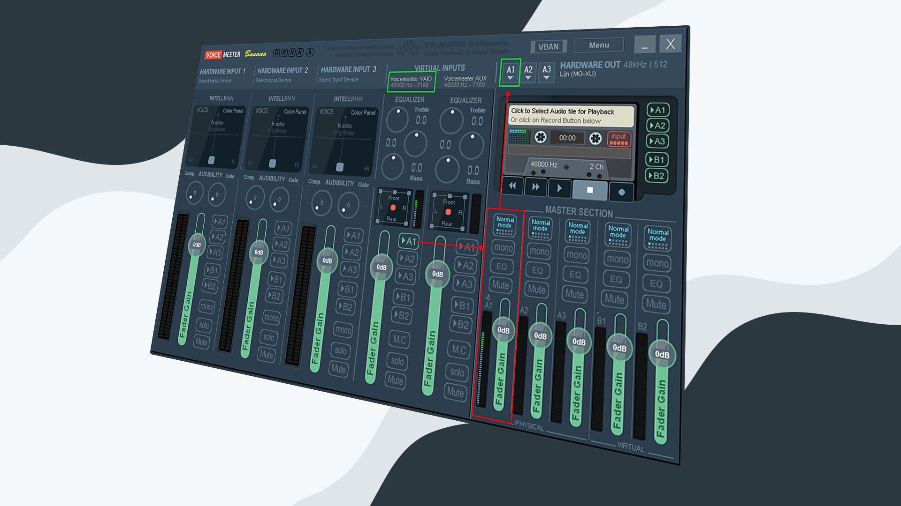
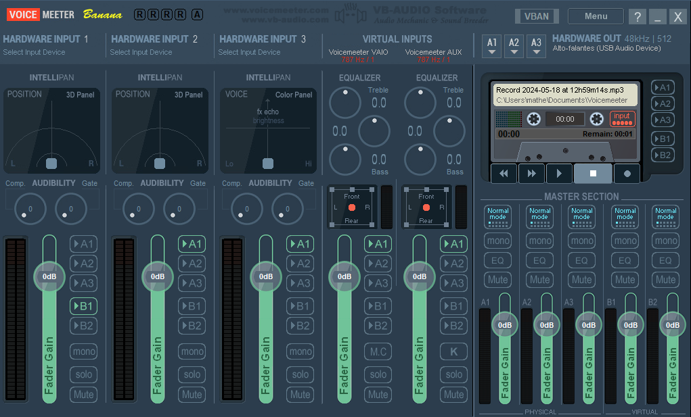
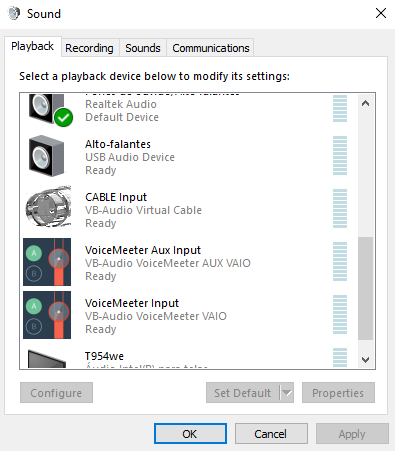

# Instalando e configurando o Voicemeeter Banana

O **Voicemeeter Banana** é um software gratuito de mixagem de áudio virtual para Windows. Ele funciona como uma mesa de som digital, permitindo que você conecte e misture diversas fontes de áudio de maneira fácil e com controle preciso da qualidade do som.

## Recursos do Voicemeeter Banana:

- **Mixar várias fontes de áudio:** Microfone, som do computador, música, instrumentos musicais e muito mais.

- **Rotear áudio para diferentes destinos:** Alto-falantes, fones de ouvido, programas de streaming e software de gravação.

- **Aplicar efeitos de áudio:** Equalização, compressão, reverb e outros.

- **Criar mixagens personalizadas:** Salvar e carregar presets para diferentes situações.

- **Monitorar seus níveis de áudio:** Visualizadores de nível de som para cada canal.

## O Voicemeeter Banana é ideal para:

- **Streamers e criadores de conteúdo:** Misturar áudio de microfone, música, jogos e outros programas para transmissões ao vivo e gravações.

- **Músicos:** Gravar e produzir música com vários instrumentos e vozes.

- **Podcasters:** Gravar podcasts com alta qualidade de som.

- **DJs:** Mixar músicas para apresentações ao vivo.

- **Usuários comuns:** Melhorar a qualidade do som do computador para ouvir música, assistir a filmes e jogar.

## Índice

Neste repostório será desmonstrado como instalar e configurar o **Voicemeeter Banana** para separar faixas de áudios advindas de:

**Aplicativos de músicas** (Spotify, Deezer, Soundcloud...)

**Aplicativos de comunicação** (Discord, TeamSpeak, VOIPs... )

**Aplicativos restantes** (navegadores, jogos, notificações...)

Portanto, você conseguirá manipular separadamente cada uma dessas faixas de áudio.

1. [Instalação do Voicemeeter Banana](#instalação-do-voicemeeter-Banana)

2. [Instalação do Virtual Audio Cable](#instalação-do-virtual-audio-cable)

3. [Configurando o Voicemeeter Banana](#configurando-o-voicemeeter-banana)

4. [Configurando o Windows](#configurando-o-windows)

5. [Créditos](#créditos)

## Instalação do Voicemeeter Banana

**Faça o download do arquivo do Voicemeeter Banana.**

Faça o download [aqui](https://github.com/matheusaudibert/voice_meeter_banana/blob/main/voicemeeterbanana/VoicemeeterProSetup.exe) ou baixe no site oficial: https://vb-audio.com/Voicemeeter/banana.htm

Após concluir o download do arquivo, inicie-o e clique em "Install".

## Instalação do Virtual Audio Cable

**Faça o download do arquivo do Virtual Audio Cable.**

**Virtual Audio Cable (VAC)**, também conhecido como **Cabo de Áudio Virtual**, é um dispositivo de entrada e saída de áudio virtual que funciona como uma ponte entre diferentes programas e aplicativos. Ele permite que você roteie o áudio de um programa para outro, sem a necessidade de cabos físicos.

Faça o download [aqui](https://github.com/matheusaudibert/voice_meeter_banana/blob/main/virtualaudiocable/VBCABLE_Driver_Pack43.zip) ou baixe no site oficial: https://vb-audio.com/Cable/index.htm

Extraia os arquivos para um pasta e execute o aplicativo **VBCABLE_Setup_x64** como administrador e cliquei em "Install Driver".

Após ter feito a instalação do **Voicemeeter Banana** e do **Virtual Audio Cable**, reinicie o seu computador.

## Configurando o Voicemeeter Banana

Depois de renicializar o seu computador, digite **Banana** na barra de pesquisa do Windows e abra o aplicativo.

Ao abrir o aplicativo pela primeira vez, você vai se deparar com isto:

Não se assuste, esta é a interface padrão do **Voicemeeter Banana**, e logo você vai aprender a como utiliza-lá.

**Para começar o a configurar o aplicativo, siga estes passos:**

1. Clique em **MENU** e habilite as opções **System Tray** e **Run on Windows Startup**.

2. Clique com o botão direito em **HARDWARE INPUT 1** e nomeie a seção como **Mic**.

3. Clique em **Mic** e selecione o seu **microfone**, o dispositvo que você está usando para de comunicar. A opção selecionada deve ser do tipo **WDM**.

   Seu programa deve estar desta maneira:

   

   Isso quer dizer que a faixa, que vai reproduzir a sua voz, foi configurada.

4. Clique com o botão direito em **HARDWARE INPUT 2** e nomeie a seção como **Music**.

5. Clique em **Music** e selecione a opção **WDM: CABLE Output (VB-Audio Virtual Cable)**

   Seu programa deve estar desta maneira:

   

   Isso quer dizer que a faixa, em que suas músicas serão reproduzidas, foi configurada.

6. Clique com o botão direito em **VIRTUAL INPUTS** e nomeie cada seção com um nome: **Sound** e **Voice**:

   Seu programa deve estar desta maneira:

   

   Isso quer dizer que a faixa da direita será destinada aos **Aplicativos de comunicação** e a faixa da esquerda aos **Aplicativos restantes**.

7. Clique em **HARDWARE INPUT (A1)** e selecione o seu **Alto-Falante**, o dispositivo que você esta usando para **receber** áudio. A opção selecionada deve ser do tipo **WDM**.

8. Deixe a opção **B1** habilitada apenas na primeira linha de áudio.

9. Clique em **MENU** e em seguida em **Restart Audio Engine**.

10. Clique em **MENU** e em seguida em **System Settings / Options...**.

    Nesta etapa, certifiqui-se de que a frequência do programa esteja em 48.000 Hz.

    Caso seu aplicativo não esteja configurado com a frequência correta você deve altera-lá clicando em **Preferred Main SampleRate** e selecionando **48.000 Hz**.

Após seguir todos os passos corretamente, o seu **Voicemeeter Banana** estará devidamente configurado, agora falta configurar as opções de áudio do Windows.

## Configurando o Windows

Digite **Sons** na barra de pesquisa do Windows e abra as configurações de som.

1. Vá até **VoiceMeeter Aux Input** e clique duas vezes.

   Feito isso, vá até **Avançado** e defina o formato padrão para **16 bit(s), 48000 Hz (Qualidade de DVD)**

   

2. Faça a mesma coisa para **VoiceMeeter Input**

3. Clique com o botão direito sobre o **VoiceMeeter Input** e defina ele como **Dispositivo Padrão**.

4. Clique com o botão direito sobre o **VoiceMeeter Aux Input** e defina ele como **Dispositivo de Cominicação Padrão**.

5. Clique
